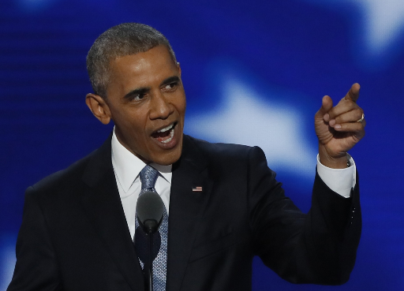

# sticker generator

This project is for generating sticker images.

### Requirements:
- typer (for an easy, awesome and typed CLI)
- mediapipe (used for segmentation)

#### Implicit requirements (notable mentions):
- opencv (used for resizing, reading, saving, dilating and eroding images)
- numpy (used for image masking to generate layers to be later merged or used as conditions)

### Constraints:
- Sticker images need to be PNG or WEBP, I choose PNG for simplicity.
- Size is also a constraint, max size is 512x512... so I rescaled the input image in order to preserve aspect ratio having maximum 512 in height or weight

### Pipeline:
1. load `asset_name`
2. check if image exists, if not exit with error
3. if image exists load it using `cv2.imread`
4. resize image keeping aspect ratio in order to be max 512 in height or width
5. optional: segmentation (can be activated using --segmentation) see [segmentation](#segmentation)
6. optional: save (can be activated using --save) see [save](#save)
7. optional: show (can be activated using --show) see [show](#show)

#### segmentation
When this option is on `mediapipe` tries to extract the people in the input image and puts a white outlying border.

In order to create the outlier border, a series of operations are done.
1. segmentation mask is applied to image, from now on `segmentation_mask`
2. `segmentation_mask` is then eroded, in order to remove noisy borders
3. a background image is created using segmentation mask as condition (white for segmentation mask and transparent for the rest), from now on `fg_image` 
4. `fg_image` is then dilated to have more round outlying border
5. `fg_image` and `output_asset` are merged using eroded `segmentation_mask` as condition, saved to `output_asset`
6. `bg_image` (transparent) is merged with `output_asset` using dilated `segmentation_mask` to put transparency on the background

#### save
When this option is on the output image is saved on the same path of the input replacing part of it (namely `original`):
- to `segmented` if `--segmentation` option is on
- to `resized` if `--segmentation`

Finally, turns output image into png so that it can save transparency, 
hence change of extension if input was not `*.png`.

#### show
When this option is on the output image is shown using `matplotlib`

## Example

Using obama images, only resized and segmented to not use too much space in this README




## Install

The project uses `pipenv`, so in order to install `pipenv` locally (use [pipenv install docs](https://pipenv.pypa.io/en/latest/install/))

```bash
# in order to install in .venv directory the virtual env
mkdir .venv
#--python 3.9 is not mandatory
pipenv install --python3.9
```

the only requirements actually are `typer` and `mediapipe`,
so `pip install mediapipe typer` would do the trick if you are not interested in pipenv (how dare you?!)
